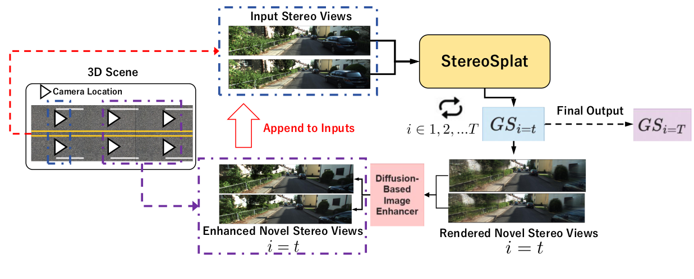

# StereoSplat+
StereoSplat+: Diffusion-Enhanced Feed-Forward Stereo Gaussian
Splatting




### Performance Evaluations

- [PixelSplat (CVPR 2024)](https://github.com/dcharatan/pixelsplat)
- [MVSplat (ECCV 2024)](https://github.com/donydchen/mvsplat)
- [OmniScene (CVPR 2025)](https://github.com/WU-CVGL/Omni-Scene)
- [DepthSplat (CVPR2025)](https://github.com/cvg/depthsplat)
---
- Ours1: StereoSplat (Input-Invarint)
- Ours2: StereoSplat+


### Pretrained-Weights (Google Drive)
- [PixelSplat](https://drive.google.com/drive/folders/1v4D0LzJ-p4afuoro-CSr96s3QOkiaGmC?usp=sharing)
- [MVSplat](https://drive.google.com/drive/folders/1l7nbn-aJx2s_107SKyRGpoYo17AaOmvb?usp=sharing)
- [OmniScene](https://drive.google.com/drive/folders/1t_ba6d0S0FqlaRHJBXw1XFue8moxWzyY?usp=sharing)
- [DepthSplat](https://drive.google.com/drive/folders/1ntWepSwW1NevE1eFsvtwCCeYXh9kfwwc?usp=sharing)
- [StereoSplat](https://drive.google.com/drive/folders/1sLbprywWeUzXHJkdqplX5rZ3-omQfeFc?usp=sharing)
- [Diffix3D Pretrained Weight](https://drive.google.com/file/d/1qOHlj0gSmYu_YXbcHGRrCdj-ck2sIQm1/view?usp=sharing)


### Training 

(1) PixelSplat

```
cd scripts/train/pixelsplat
sh train.sh
```
(2) MVSplat

```
cd scripts/train/mvsplat
sh train.sh
```
(3) depthsplat

```
cd scripts/train/depthsplat
sh train.sh
```
(4) omniscene
```
cd scripts/train/omnigs
sh train.sh
```

(5) **StereoSplat (Ours)**
```
cd scripts/train/volumefusion
sh train_revision.sh
```

### Evaluations

#### Others Methods


(1) Pixelsplat 

- evaluations feedforward
```
# using `--output_vis` to render video as well, default is OFF.
cd scripts/evaluations/pixelsplat
sh render_view_inside_bin.sh
```
- evaluations bev views
```
cd scripts/evaluations/BEV_Visualizations
sh render_views_with_pixelsplat.sh
```

(2) DepthSplat
- evaluations feedforward
```
cd scripts/evaluations/depthsplat
sh render_view_inside_bin.sh
```

- evaluations bev views
```
cd scripts/evaluations/BEV_Visualizations
sh render_views_with_depthsplat.sh
```

(3) MVSplat

- evaluations feedforward
```
cd scripts/evaluations/mvsplat
sh render_view_inside_bin.sh
```
- evaluations bev veiws
```
cd scripts/evaluations/BEV_Visualizations
sh render_views_with_mvsplat.sh
```

(4) Omniscene
- evaluations feedforward
```
cd scripts/evaluations/omnigs
sh render_view_inside_bin.sh
```
- evaluations bev views
```
cd scripts/evaluations/BEV_Visualizations
sh render_views_with_omnigs.sh
```
---

### Our Proposed Methods

(1) Input-Invariant StereoSplat

- evaluations feedforward
```
cd scripts/evaluations/stereosplat
sh render_views_inside_bin.sh
```
- evaluations bev views
```
cd scripts/evaluations/BEV_Visualizations
sh render_views_with_input_invariant_stereosplat.sh
```


(2) StereoSplat+: One-Single Pass
- evaluations feedforward

```
cd scripts/evaluations/stereosplat

sh rendered_all_rgb_depths_metrics_with_offset_diff.sh
```

- evaluations bev views

```
cd scripts/evaluations/BEV_Visualizations

sh rendered_progressive_with_diffix3d_bev_views.sh

```

