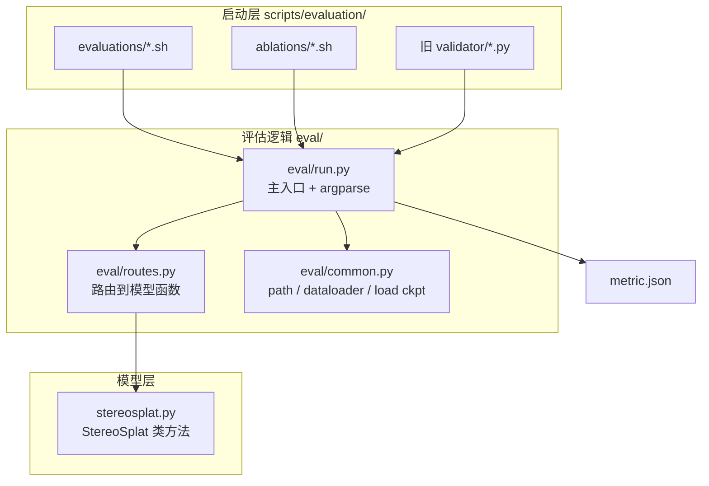
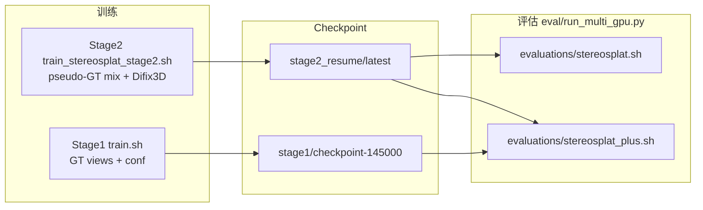

# Confidence StereoSplat — 评估系统完整说明

本仓库的核心是 **带 confidence 的 StereoSplat（15D Gaussians）** 的训练与评估（**StereoSplat_Plus / with-conf 专用**）。  
所有 checkpoint、评估脚本与 pixel-level fusion 均默认 **15D conf 模型**；不支持加载原版 14D 无 conf 权重跑默认流程。

- 自定义 rasterizer 输出 `rendered_conf`，fusion 与 conf 指标依赖此通道
- 无 `train_kitti360_stereosplat.py`（14D）训练入口；仅 `train_kitti360_stereosplat_with_conf.py`

所有评估逻辑集中在 `eval/` 目录；`scripts/evaluation/` 下的 shell 直接调用 `eval/run_multi_gpu.py` 或 `eval/run.py`。

> 本文件侧重 **论文三种 eval_mode**、调用链、CLI 参数与排错。快速上手见仓库根目录 [README.md](../../README.md#evaluation)。

### 论文与 eval_mode 对应（重要）

[IROS 2026 / arXiv:2607.08808](https://arxiv.org/abs/2607.08808) 中的 **StereoSplat+**（一次 progressive 推理 + Difix3D + **confidence-guided fusion**）在本仓库对应：

| 论文概念 | 本仓库 `eval_mode` | 模型函数 |  bundled shell |
|----------|-------------------|----------|----------------|
| StereoSplat（2-view baseline） | `stereosplat` | `infer_stereosplat_two_gt_views_forward` | `evaluations/stereosplat.sh` |
| **StereoSplat+（论文主结果）** | **`pixel_fusion`** + `--conf_pixel_level_fusion` | `infer_pixel_fusion_pose_injection_single_model` | **`evaluations/stereosplat_plus.sh`** |
| S+ progressive，**无** pixel conf 融合（消融） | `stereosplat_plus` | `infer_stereosplat_plus_pose_injection_single_model` | 无默认 shell；CLI 手动指定 |

`run_multi_gpu.py` 默认 `--eval_mode pixel_fusion`。`stereosplat_plus.sh` **文件名**沿用历史命名，内部跑的是 **pixel_fusion**（见脚本内 `[Launch] pixel_fusion` 与 `--conf_pixel_level_fusion --fusion_mode soft`）。

---

## 目录

1. [概念：Stage × 评估模式 × 架构](#1-概念stage--评估模式--架构)
2. [调用链总览](#2-调用链总览)
3. [目录结构](#3-目录结构)
4. [实验矩阵（该跑哪个脚本）](#4-实验矩阵该跑哪个脚本)
5. [三种评估模式详解](#5-三种评估模式详解)
6. [训练与评估的对应关系](#6-训练与评估的对应关系)
7. [使用方法](#7-使用方法)
8. [CLI 参数完整说明](#8-cli-参数完整说明)
9. [旧路径兼容映射](#9-旧路径兼容映射)
10. [输出结果说明](#10-输出结果说明)
11. [自定义路径与调试](#11-自定义路径与调试)

---

## 1. 概念：Stage × 评估模式 × 架构

评估用三个维度描述一次实验：

| 维度 | 取值 | 含义 |
|------|------|------|
| **training_stage** | `stage1` / `stage2` | 用哪套 config、dataloader；对应哪一阶段训练产物 |
| **eval_mode** | `stereosplat` / `stereosplat_plus` / `pixel_fusion` | 推理管线；**论文 StereoSplat+ = `pixel_fusion`**（见上文） |
| **architecture** | `whole` / `separated` | 单 checkpoint 还是「冻结 Stage1 + Stage2」双模型 |

### Stage1 vs Stage2

| | **Stage1** | **Stage2** |
|--|------------|------------|
| **训练数据** | 全部 GT view | Pseudo-GT mix（冻结 Stage1 产 GS，随机混入 GT） |
| **训练脚本** | `scripts/train/complete/train_stereosplat.sh` | `scripts/train/complete/train_stereosplat_plus.sh` |
| **Trainer** | `trainer/train_kitti360_stereosplat_with_conf.py` | `trainer/train_kitti360_stereosplat_plus_with_difix3d.py` |
| **Config** | `input_invariant_stereosplat_default.py` | `input_invariant_stereosplat_stage2.py` |
| **world_center** | `First_LiDAR_3_Uniform` | `First_Stage2` |
| **典型权重** | `.../withconf/stage1/latest/checkpoint-145000` | `.../withconf/stage2_resume/latest` |
| **评估架构** | 仅 `whole` | `whole` + `separated` |

### 三种 eval_mode

```
① stereosplat（论文 Table II「StereoSplat」基线）
   输入 2-view GT → forward 一次 → 3DGS → 渲染 novel view → 指标

② stereosplat_plus（消融：S+ progressive，无 conf 融合）
   与 ③ 相同 progressive 流程，但第二次 forward 后直接用 G_plus 渲染，不做 2-view vs multiview 的 pixel conf 融合

③ pixel_fusion（论文 Table I「StereoSplat+」主结果 ★）
   2-view → G_base 渲染  ‖  pseudo-multiview → G_plus 渲染
   → 按 rendered confidence 逐像素融合（`--conf_pixel_level_fusion`，推荐 `--fusion_mode soft`）
   → 可选 Difix3D 增强 pseudo views（`--use_ref` + Difix 权重）
```

**推荐**：复现论文数字 → **`pixel_fusion` + Difix3D + `--conf_pixel_level_fusion`**（即 `evaluations/stereosplat_plus.sh`）。

`--conf_pixel_level_fusion` 仅在 `eval_mode=pixel_fusion` 时生效；关闭时仍走 pixel_fusion progressive 管线，但**不做**论文中的 confidence fusion（接近 `stereosplat_plus` 行为）。

### whole vs separated

| architecture | 何时使用 | 加载的权重 |
|--------------|----------|------------|
| **whole** | 单模型推理 | 仅 `--pretrained_model_path` |
| **separated** | Stage2 的 S+ / fusion | `--pretrained_model_path`（Stage2）+ `--stage_1_model_path`（冻结 Stage1） |

Stage1 评估只有 `whole`（单 checkpoint）。

---

## 2. 调用链总览

### 2.1 整体数据流



### 2.2 一次评估的内部步骤（`eval/run.py`）

1. **Bootstrap**：把 `stereosplat/` 根目录加入 `sys.path`（支持 `python eval/run.py` 与 wrapper 两种启动方式）。
2. **解析参数**：`--training_stage`、`--eval_mode`、`--architecture` 及 checkpoint / Difix3D 等；`stereosplat_plus` / `pixel_fusion` 未传 `--pseudo_ratio` 时默认 `[0.5, 1.0]`。
3. **加载 config**：未指定 `--config_path` 时，按 stage 自动选择 default / stage2 config。
4. **构建 dataloader**：根据 config 的 `world_center` 选对应 dataloader 模块（含 `First_Stage2` → `KITTI360_First_LiDAR_Random_Stage2`）。
5. **加载模型**：
   - 主模型 `my_model` ← `--pretrained_model_path`
   - 若 `architecture=separated`：额外加载冻结 `frozen_stage_1_model` ← `--stage_1_model_path`
   - 若需要 Difix3D：加载 `DifixRef` ← `--pretrained_diffix_model_path`
6. **逐 bin 推理**：`eval/routes.py` 的 `run_batch_inference()` 根据 mode 调用 `stereosplat.py` 中对应函数。
7. **聚合指标**：RGB / Depth / Conf 等写入 `output_folder/metric.json`。

### 2.3 eval_mode → 模型函数映射

| eval_mode | architecture | stereosplat.py 中的函数 | 关键参数 |
|-----------|--------------|---------------------------|----------|
| `stereosplat` | whole | `infer_stereosplat_two_gt_views_forward()` | `view_num=2` |
| `stereosplat_plus` | whole | `infer_stereosplat_plus_pose_injection_single_model()` | `--pseudo_ratio`（默认 `0.5 1.0` = center+last） |
| `stereosplat_plus` | separated | `infer_stereosplat_plus_frozen_stage1_two_models()` | `--pseudo_ratio`；双模型 S+，无 conf 融合 |
| `pixel_fusion` | whole | `infer_pixel_fusion_pose_injection_single_model()` | `--pseudo_ratio`；`--conf_pixel_level_fusion` / `--conf_fusion_margin` |
| `pixel_fusion` | separated | `infer_pixel_fusion_pose_injection_frozen_stage1_two_models()` | 双模型 + 可选 conf 融合 |

**whole 模式下 `stereosplat_plus` vs `pixel_fusion`（重要）：**

| | `stereosplat_plus` | `pixel_fusion`（论文 StereoSplat+） |
|--|-------------------|-------------------------------------|
| Progressive（render → Difix → reinject） | ✓ | ✓ |
| 第二次 forward 输出 | 仅 **G_plus** 渲染 | **G_base 渲染** 与 **G_plus 渲染** 两路 |
| Confidence fusion | ✗ | ✓（`--conf_pixel_level_fusion`） |
| 论文 Table I 最后一行 | ✗ | ✓ |

二者共用 `pseudo_ratio`（默认 `0.5 1.0` = center+last）。`pixel_fusion` 还可选 A1 `--conf_fusion_margin`。

---

## 3. 目录结构

```
stereosplat/
├── eval/                                    # ★ 评估逻辑（维护这里）
│   ├── README.md                            # 本文件
│   ├── run.py                               # 主入口
│   ├── routes.py                            # mode → 模型函数
│   └── common.py                            # 公共工具
│
├── validator/                               # 兼容层（薄 wrapper，勿在这里写业务逻辑）
│   ├── stereosplat/
│   │   ├── rendered_views_inside_bin.py     → eval/run.py (stereosplat)
│   │   └── rendered_view_inside_bin_plus_diffix.py → eval/run.py (stereosplat_plus whole)
│   ├── stereosplat_conf/
│   │   ├── posed_input_view_injected_selected_stage2.py → stereosplat_plus separated
│   │   └── posed_input_view_injected_selected.py        → pixel_fusion whole (legacy dev)
│   └── stereosplat_plus_conf_fusion/two-stage/
│       ├── posed_input_view_injected_selected_whole_model_pixel_level.py
│       └── posed_input_view_injected_selected_sep_model_pixel_level.py
│
├── scripts/evaluation/
│   ├── evaluations/
│   │   ├── stereosplat.sh              # 2-view 基线
│   │   └── stereosplat_plus.sh         # 论文 S+（pixel_fusion）
│   └── ablations/
│       ├── stereosplat.sh
│       └── stereosplat_plus.sh
│
├── src/stereosplat/models_lab/StereoSplat/stereosplat.py   # 推理算法实现
├── trainer/                                 # 训练入口（eval 不经过这里）
└── accelerate_configs/inference/gpu_*.yaml  # 推理 GPU 配置
```

---

## 4. 实验矩阵（该跑哪个脚本）

### 4.0 评估 Shell（当前仓库：`scripts/evaluation/`）

| 路径 | 用途 |
|------|------|
| `evaluations/stereosplat.sh` | Stage2 权重 · 2-view 基线（`eval_mode=stereosplat`） |
| **`evaluations/stereosplat_plus.sh`** | **论文 StereoSplat+** · `pixel_fusion` + Difix3D + soft conf fusion + `--self_pseudo` |
| `ablations/stereosplat.sh` | 同上基线，ablation val split |
| `ablations/stereosplat_plus.sh` | 同上 S+，ablation val split |

`stereosplat_plus.sh` 未显式传 `--eval_mode`（`run_multi_gpu.py` 默认为 `pixel_fusion`），并开启：

```bash
--use_ref --conf_pixel_level_fusion --fusion_mode soft --self_pseudo
```

可视化脚本见 `scripts/visualization/`（`--output_vis` 导出 RGB/depth）。

> **历史路径**：旧版 `scripts/evaluation/stage{1,2}/`、`conf_fusion/pixel_level/legacy_*.sh` 已不在本开源分支维护；等价逻辑请用 `eval/run.py` CLI + 上表 shell。

### 4.1 按 eval_mode 选型

| 目标 | eval_mode | 推荐 shell / CLI |
|------|-----------|------------------|
| 论文 / Table II StereoSplat 基线 | `stereosplat` | `evaluations/stereosplat.sh` |
| **论文 / Table I StereoSplat+** | **`pixel_fusion`** + conf fusion | **`evaluations/stereosplat_plus.sh`** |
| 消融：progressive 但不融合 | `stereosplat_plus` | 手动 `eval/run_multi_gpu.py --eval_mode stereosplat_plus ...` |
| 双模型 separated | `pixel_fusion` + `--architecture separated` | CLI + `--stage_1_model_path` |
| BEV 外推（Fig.6） | `bev` / `bev_plus` | CLI（无 bundled shell） |

### 4.3 默认 checkpoint / 数据（在各 shell 内用环境变量覆盖）

```bash
export STEREOSPLAT_CHECKPOINT=/path/to/stage2_checkpoint
export DIFIX3D_WEIGHTS=/path/to/model_130001.pkl
bash scripts/evaluation/evaluations/stereosplat_plus.sh
```

### 4.4 `pseudo_ratio`（pose view selection）

pose injection / separated 推理在 **first GT stereo** 之外还要注入 **第二、第三组 stereo**。  
CLI：`--pseudo_ratio <r2> <r3>`，shell 默认 `0.50 1.0`。

- **`[0.5, 1.0]`**：第二组 = **center stereo**，第三组 = **last stereo**（Stage2 训练默认，代码特判快速路径）
- **其他值**：在轨迹剩余 stereo pair 上按比例取索引（`prepare_tripleview_by_ratio_index`）

**会读 `pseudo_ratio` 的模型函数**：`infer_stereosplat_plus_pose_injection_single_model`、`infer_stereosplat_plus_frozen_stage1_two_models`、`infer_pixel_fusion_pose_injection_*`。  
**不读**：`infer_stereosplat_two_gt_views_forward`（纯 2-view）。

### 4.5 默认数据列表

| 用途 | 路径 |
|------|------|
| 正式评估 | `filenames/kitti360/train_complete/val.txt`（约 5485 bins） |
| 可视化（默认） | `filenames/kitti360/train_complete/demo.txt`（9 bins，`--output_vis` 时自动切换） |
| 可视化（扩展） | `demo_more.txt`（27 bins，可手动 `--demo_filelist .../demo_more.txt`） |

---

## 5. 三种评估模式详解

### 5.1 Mode ①：stereosplat

- **输入**：2 张 GT stereo view（first view pair）
- **流程**：单次 `forward` → 3D Gaussians → 在 bin 内所有 forward view 上渲染
- **不涉及**：pseudo view、Difix3D、confidence fusion
- **典型用途**：基础 feed-forward 3DGS 质量基线

### 5.2 Mode ②：`stereosplat_plus`（消融，非论文主结果）

**不含**论文 III-C 的 confidence-guided fusion：第二次 forward 后只用 **G_plus** 单路渲染。

- 函数：`infer_stereosplat_plus_pose_injection_single_model`（whole）/ `infer_stereosplat_plus_frozen_stage1_two_models`（separated）
- 用途：对比「加 progressive 但不融合」的中间 ablation
- **无 bundled shell**；需 CLI：`--eval_mode stereosplat_plus`

### 5.3 Mode ③：`pixel_fusion`（论文 StereoSplat+ ★）

与 5.2 共享 progressive 流程（2-view → 渲染 pseudo → Difix → reinject → 再 forward），额外对 **两路 novel-view 渲染** 做 confidence 融合：

| architecture | 融合的两路 |
|--------------|------------|
| whole | 同 checkpoint：2-view GS 渲染 vs pseudo-multiview GS 渲染 |
| separated | Stage1 渲染 vs Stage2 渲染 |

- **2D fusion off**：不加 `--conf_pixel_level_fusion`（接近 5.2 消融行为）
- **2D fusion on（legacy）**：`conf_b >= conf_a` 选 B（平局偏 plus）
- **2D fusion on（A1）**：`--conf_fusion_margin 0.05` → `conf_b > conf_a + margin` 才选 B（平局偏 base）

---

## 6. 训练与评估的对应关系



| 训练产出 | 常用于哪些评估 |
|----------|----------------|
| Stage2（`train_stereosplat_plus.sh`） | `evaluations/stereosplat.sh`、`evaluations/stereosplat_plus.sh`（默认 whole 单 checkpoint） |
| Stage1 | separated 评估时的 `--stage_1_model_path`；或 Stage1-only 实验（CLI 手动指定） |

---

## 7. 使用方法

### 7.1 前置条件

```bash
cd stereosplat_conf
pixi install -e cu118 && pixi run -e cu118 setup
```

所有评估脚本默认：

```bash
export PYTORCH_CUDA_ALLOC_CONF=expandable_segments:True
export PYTHONPATH="${STEREOSPLAT_ROOT}:${PYTHONPATH}"
```

并使用 `pixi run -e cu118 accelerate launch`。

### 7.2 推荐：用 bundled shell 跑（最简单）

在 `stereosplat_conf/` 根目录执行：

```bash
# 论文 StereoSplat+（pixel_fusion + Difix + soft conf fusion）
bash scripts/evaluation/evaluations/stereosplat_plus.sh

# 2-view 基线（论文 StereoSplat）
bash scripts/evaluation/evaluations/stereosplat.sh

# Ablation val split（同上两种模式）
bash scripts/evaluation/ablations/stereosplat_plus.sh
bash scripts/evaluation/ablations/stereosplat.sh
```

权重与 Difix 路径可通过环境变量覆盖（见 §4.3），或直接编辑各 shell 顶部变量。

### 7.3 直接调用 eval/run.py（最灵活）

```bash
cd stereosplat_conf

pixi run -e cu118 accelerate launch \
  --config-file accelerate_configs/inference/gpu_1.yaml \
  eval/run.py \
  --training_stage stage2 \
  --eval_mode pixel_fusion \
  --architecture separated \
  --output_folder /data1/.../results/my_exp \
  --pretrained_model_path /data1/.../stage2_resume/latest \
  --stage_1_model_path /data1/.../stage1/latest/checkpoint-145000 \
  --val_filelist filenames/kitti360/train_complete/val.txt \
  --demo_filelist filenames/kitti360/train_complete/demo_more.txt \
  --pretrained_diffix_model_path /data4/.../model_130001.pkl \
  --pseudo_ratio 0.5 1.0 \
  --use_diffix3d \
  --use_ref \
  --conf_pixel_level_fusion
```

`--config_path` 可省略；由 `--training_stage` 自动选择。

### 7.4 旧 validator 路径（向后兼容）

`validator/*.py` 仍可作为薄 wrapper 调用 `eval/run.py`（见 §9）。开源分支推荐直接用 `evaluations/*.sh` 或 `eval/run.py`。

### 7.5 可视化（`--output_vis` + `demo.txt`）

**代码已实现**（`eval/run.py` + `stereosplat.py` 的 `vis=True` 分支），行为与旧 validator 一致：

1. 加 `--output_vis` 后，dataloader 改用 `--demo_filelist`（默认 `demo.txt`，9 个 bin）
2. 各 bin 在 `output_folder/<bin_token>/` 下保存 RGB、depth、conf 等图
3. **不写** `metric.json`（仅看图，不算全量指标）

**方式 A：在 `evaluations/*.sh` 的 launch 命令末尾追加 `--output_vis`**

**方式 B：命令行追加 flag**：

```bash
pixi run -e cu118 accelerate launch ... eval/run.py \
  ... \
  --output_vis
```

**方式 C：用更大的 demo 子集**：

```bash
--output_vis --demo_filelist filenames/kitti360/train_complete/demo_more.txt
```

### 7.6 查看帮助

```bash
pixi run -e cu118 python eval/run.py --help
```

---

## 8. CLI 参数完整说明

### 8.1 核心三元组（必填语义）

| 参数 | 取值 | 说明 |
|------|------|------|
| `--training_stage` | `stage1` / `stage2` | 决定默认 config 与训练阶段语义 |
| `--eval_mode` | `stereosplat` / `stereosplat_plus` / `pixel_fusion` | 评估管线（见第 5 节） |
| `--architecture` | `whole` / `separated` | 默认 `whole`；separated 需 Stage1 冻结权重 |

### 8.2 路径与 IO

| 参数 | 必填 | 说明 |
|------|------|------|
| `--output_folder` | **是** | 结果目录；写入 `metric.json` 与可选可视化 |
| `--config_path` | 否 | 默认按 stage 自动选择 |
| `--pretrained_model_path` | 推荐 | 主模型 checkpoint（目录或权重文件） |
| `--stage_1_model_path` | separated 必填 | 冻结 Stage1 权重 |
| `--val_filelist` | 推荐 | 正式评估 bin 列表 |
| `--demo_filelist` | 推荐 | `--output_vis` 时使用 |

### 8.3 Difix3D 相关

| 参数 | 说明 |
|------|------|
| `--use_diffix3d` | 启用 Difix3D 修复 pseudo 图 |
| `--use_ref` | 使用 stereo reference（mv_unet） |
| `--pretrained_diffix_model_path` | Difix3D 权重 `.pkl` |
| `--timestep` | 默认 `199` |
| `--prompt` | 默认 `"remove degradation"` |
| `--deterministic_vae_encode` / `--deterministic_scheduler_step` | 确定性推理 |

> `pixel_fusion + whole` 会**强制加载** Difix3D 权重（与旧 whole pixel validator 行为一致），即使未加 `--use_diffix3d`。

### 8.4 Confidence fusion（2D）

| 参数 | 说明 |
|------|------|
| `--conf_pixel_level_fusion` | 2D 逐像素 conf 融合（论文 S+ 必需） |
| `--conf_fusion_margin` | A1：选 B 需 `conf_b > conf_a + margin`；需与 `--conf_pixel_level_fusion` 同开 |
| `--fusion_mode` | `soft`（推荐，shell 默认）或 `hard` |
| `--pseudo_ratio` | 空格分隔列表，如 `0.5 1.0`；`stereosplat_plus` 与 `pixel_fusion` 均使用；省略时默认 `0.5 1.0` |

### 8.5 其它

| 参数 | 说明 |
|------|------|
| `--output_vis` | 保存可视化；切换到 demo filelist |
| `--use-wandb` 及 `--wandb-*` | 可选 W&B 日志 |

---

## 9. 旧路径兼容映射

### 9.1 validator wrapper 机制

每个旧 `validator/*.py` 现在类似：

```python
# validator/.../posed_input_view_injected_selected_sep_model_pixel_level.py
from eval.run import main

if __name__ == "__main__":
    main(defaults={
        "training_stage": "stage2",
        "eval_mode": "pixel_fusion",
        "architecture": "separated",
    })
```

命令行传入的 `--output_folder`、`--pretrained_model_path` 等**覆盖** defaults。  
因此旧 shell 里写的 validator 路径**无需修改**也能跑。

### 9.2 文件对照表

| 旧 validator 文件 | defaults |
|-------------------|----------|
| `validator/stereosplat/rendered_views_inside_bin.py` | stage2, stereosplat, whole |
| `validator/stereosplat/rendered_view_inside_bin_plus_diffix.py` | stage2, stereosplat_plus, whole |
| `validator/stereosplat_plus/posed_input_view_injected_selected_stage2.py` | stage2, stereosplat_plus, separated |
| `validator/.../whole_model_pixel_level.py` | stage2, pixel_fusion, whole |
| `validator/.../sep_model_pixel_level.py` | stage2, pixel_fusion, separated |
| `validator/stereosplat_plus/posed_input_view_injected_selected.py` | stage1, pixel_fusion, whole（legacy dev） |

---

## 10. 输出结果说明

### 10.1 metric.json

评估结束后，主进程在 `--output_folder/metric.json` 写入：

```json
{
  "rgb": { "all_view_psnr_average": ..., "all_view_ssim_average": ..., ... },
  "depth": { "all_view_Abs_Rel_average": ..., ... },
  "conf": { ... },
  "conf_fused": { ... },
  "conf_stage1": { ... },
  "conf_stage2": { ... },
  "conf_2view": { ... },
  "conf_pseudo_multiview": { ... }
}
```

哪些 key 出现取决于 `eval_mode` 与是否开启 fusion；空 section 不会写入。

### 10.2 可视化目录（`--output_vis`）

每个 bin 下可能包含：

```
<bin_token>/
├── rendered_images/
├── rendered_depth/
├── rendered_conf/          # conf 模型
├── GT Images/
└── GT Depth/
```

separated / fusion 模式可能额外有 `rendered_conf_stage1/` 等。

---

## 11. 自定义路径与调试

### 11.1 改默认权重 / Difix 路径

编辑 **`scripts/evaluation/evaluations/*.sh`** 顶部变量，或使用环境变量（§4.3）：

```bash
export STEREOSPLAT_CHECKPOINT=/path/to/stage2_checkpoint
export DIFIX3D_WEIGHTS=/path/to/model_130001.pkl
```

### 11.2 改 GPU

修改各函数里的 `accelerate_config_path`，如 `gpu_0.yaml` → `gpu_1.yaml`。  
配置目录：`accelerate_configs/inference/gpu_*.yaml`

### 11.3 改输出目录

在各函数里的 `output_folder` 变量处修改。

### 11.4 性能注意

- 全量 `val.txt` 约 5485 bins，耗时很长
- 脚本默认 `CUDA_LAUNCH_BLOCKING=1` 便于查错，但**极慢**；确认无误后可去掉该行加速
- `pixel_fusion` 比 `stereosplat` 多一路渲染，更慢
- 全量 val 请用 `bash script.sh` 而非 `sh`

### 11.5 修改评估逻辑时改哪里

| 想改什么 | 改哪个文件 |
|----------|------------|
| 加新 eval_mode、换模型函数 | `eval/routes.py` |
| 参数、dataloader、加载权重 | `eval/run.py` / `eval/common.py` |
| 启动命令、默认路径 | `scripts/evaluation/evaluations/*.sh` |
| 算法本身（2D 融合、渲染） | `src/.../stereosplat.py` |
| **不要**在 `validator/` 写业务逻辑 | 仅保留 wrapper |

---

## 附录：一条命令对照表

| 我想跑… | 命令 |
|---------|------|
| **论文 StereoSplat+（pixel fusion + Difix）** | `bash scripts/evaluation/evaluations/stereosplat_plus.sh` |
| 2-view 基线（论文 StereoSplat） | `bash scripts/evaluation/evaluations/stereosplat.sh` |
| Ablation split · S+ | `bash scripts/evaluation/ablations/stereosplat_plus.sh` |
| Ablation split · 2-view | `bash scripts/evaluation/ablations/stereosplat.sh` |
| 消融：progressive 无 conf 融合 | `pixi run -e cu118 ... eval/run_multi_gpu.py --eval_mode stereosplat_plus ...` |
| separated 双模型 fusion | `... eval/run_multi_gpu.py --eval_mode pixel_fusion --architecture separated --stage_1_model_path ...` |

更完整的参数控制请直接用 `eval/run.py`（第 7.3 节）。
