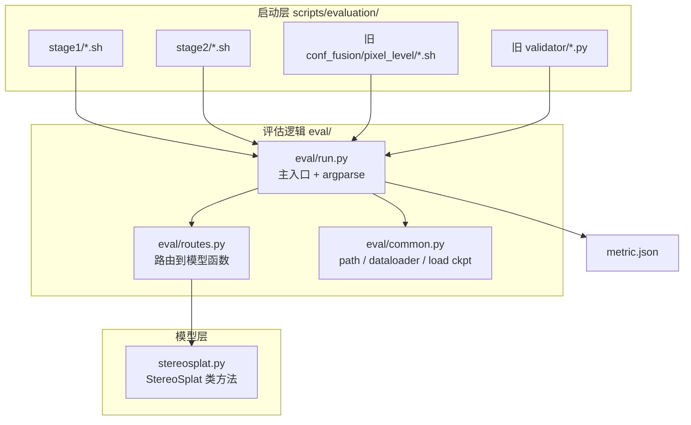
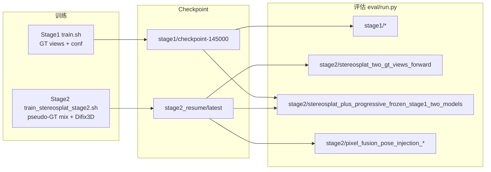

# Confidence StereoSplat — 评估系统完整说明

本仓库的核心是 **带 confidence 的 StereoSplat（15D Gaussians）** 的训练与评估（**StereoSplat_Plus / with-conf 专用**）。  
所有 checkpoint、评估脚本与 pixel-level fusion 均默认 **15D conf 模型**；不支持加载原版 14D 无 conf 权重跑默认流程。

- 自定义 rasterizer 输出 `rendered_conf`，fusion 与 conf 指标依赖此通道
- 无 `train_kitti360_stereosplat.py`（14D）训练入口；仅 `train_kitti360_stereosplat_with_conf.py`

所有评估逻辑集中在 `eval/` 目录；`scripts/evaluation/` 下的 shell 直接调用 `eval/run_multi_gpu.py` 或 `eval/run.py`。

> **8 种标准推理 + Stage1 融合扩展（GS / GS+Pixel / Oracle）对照表** → 见上级文档 **[../README.md#推理方式详解](../README.md#推理方式详解)**。  
> 本文件侧重调用链实现、CLI 参数与排错。

---

## 目录

1. [概念：Stage × 评估模式 × 架构](#1-概念stage--评估模式--架构)
2. [调用链总览](#2-调用链总览)
3. [目录结构](#3-目录结构)
4. [实验矩阵（该跑哪个脚本）](#4-实验矩阵该跑哪个脚本)
5. [三种评估模式详解](#5-三种评估模式详解)
6. [训练与评估的对应关系](#6-训练与评估的对应关系)
7. [使用方法](#7-使用方法)
8. [CLI 参数完整说明](#8-cli-参数完整说明)
9. [旧路径兼容映射](#9-旧路径兼容映射)
10. [输出结果说明](#10-输出结果说明)
11. [自定义路径与调试](#11-自定义路径与调试)
12. [常见问题](#12-常见问题)

---

## 1. 概念：Stage × 评估模式 × 架构

评估用三个维度描述一次实验：

| 维度 | 取值 | 含义 |
|------|------|------|
| **training_stage** | `stage1` / `stage2` | 用哪套 config、dataloader；对应哪一阶段训练产物 |
| **eval_mode** | `stereosplat` / `stereosplat_plus` / `pixel_fusion` | 推理管线复杂度（递进关系，见下文） |
| **architecture** | `whole` / `separated` | 单 checkpoint 还是「冻结 Stage1 + Stage2」双模型 |

### Stage1 vs Stage2

| | **Stage1** | **Stage2** |
|--|------------|------------|
| **训练数据** | 全部 GT view | Pseudo-GT mix（冻结 Stage1 产 GS，随机混入 GT） |
| **训练脚本** | `scripts/train/stereosplat/train.sh` | `scripts/train/stereosplat/train_stereosplat_stage2.sh` |
| **Trainer** | `trainer/train_kitti360_stereosplat_with_conf.py` | `trainer/train_kitti360_stereosplat_plus_with_difix3d.py` |
| **Config** | `input_invariant_stereosplat_default.py` | `input_invariant_stereosplat_stage2.py` |
| **world_center** | `First_LiDAR_3_Uniform` | `First_Stage2` |
| **典型权重** | `.../withconf/stage1/latest/checkpoint-145000` | `.../withconf/stage2_resume/latest` |
| **评估架构** | 仅 `whole` | `whole` + `separated` |

### 三种 eval_mode（递进）

```
① stereosplat
   输入 2-view GT → forward 一次 → 3DGS → 渲染 novel view → 指标

② stereosplat_plus（在 ① 基础上）
   2-view → 3DGS → 全轨迹渲染 → pseudo_ratio 选 pseudo stereo → 可选 Difix3D → re-inject → 再 forward → 指标

③ pixel_fusion（在 ② 基础上）
   两路 render（例如 Stage1 vs Stage2，或 2-view GS vs pseudo-multiview GS）
   → 按 confidence 逐像素融合 → 指标
   可选 A1：--conf_fusion_margin（平局偏 base）

③′ GS voxel fusion（eval 扩展，Stage1 whole 已实现）
   G_base vs G_plus 在 3D 体素内按 mean(conf) + margin 融合 → G_gs_fused → 单次渲染

③″ GS + Pixel 联合（eval 扩展）
   先 ③′，再 G_base 渲染 vs G_gs_fused 渲染做 pixel 融合
```

`--conf_pixel_level_fusion` 仅在 `eval_mode=pixel_fusion` 时生效；关闭时仍走 pixel_fusion 管线但不做 2D 融合。  
`--gs_conf_fusion` 与 2D 融合**不互斥**，可同时开启（联合模式）。

### whole vs separated

| architecture | 何时使用 | 加载的权重 |
|--------------|----------|------------|
| **whole** | 单模型推理 | 仅 `--pretrained_model_path` |
| **separated** | Stage2 的 S+ / fusion | `--pretrained_model_path`（Stage2）+ `--stage_1_model_path`（冻结 Stage1） |

Stage1 评估只有 `whole`（单 checkpoint）。

---

## 2. 调用链总览

### 2.1 整体数据流



### 2.2 一次评估的内部步骤（`eval/run.py`）

1. **Bootstrap**：把 `stereosplat/` 根目录加入 `sys.path`（支持 `python eval/run.py` 与 wrapper 两种启动方式）。
2. **解析参数**：`--training_stage`、`--eval_mode`、`--architecture` 及 checkpoint / Difix3D 等；`stereosplat_plus` / `pixel_fusion` 未传 `--pseudo_ratio` 时默认 `[0.5, 1.0]`。
3. **加载 config**：未指定 `--config_path` 时，按 stage 自动选择 default / stage2 config。
4. **构建 dataloader**：根据 config 的 `world_center` 选对应 dataloader 模块（含 `First_Stage2` → `KITTI360_First_LiDAR_Random_Stage2`）。
5. **加载模型**：
   - 主模型 `my_model` ← `--pretrained_model_path`
   - 若 `architecture=separated`：额外加载冻结 `frozen_stage_1_model` ← `--stage_1_model_path`
   - 若需要 Difix3D：加载 `DifixRef` ← `--pretrained_diffix_model_path`
6. **逐 bin 推理**：`eval/routes.py` 的 `run_batch_inference()` 根据 mode 调用 `stereosplat.py` 中对应函数。
7. **聚合指标**：RGB / Depth / Conf 等写入 `output_folder/metric.json`。

### 2.3 eval_mode → 模型函数映射

| eval_mode | architecture | stereosplat.py 中的函数 | 关键参数 |
|-----------|--------------|---------------------------|----------|
| `stereosplat` | whole | `infer_stereosplat_two_gt_views_forward()` | `view_num=2` |
| `stereosplat_plus` | whole | `infer_stereosplat_plus_pose_injection_single_model()` | `--pseudo_ratio`（默认 `0.5 1.0` = center+last） |
| `stereosplat_plus` | separated | `infer_stereosplat_plus_frozen_stage1_two_models()` | `--pseudo_ratio`；双模型 S+，无 conf 融合 |
| `pixel_fusion` | whole | `infer_pixel_fusion_pose_injection_single_model()` | `--pseudo_ratio`；可选 2D `--conf_pixel_level_fusion` / `--conf_fusion_margin`；可选 3D `--gs_conf_fusion` 及 GS 参数 |
| `pixel_fusion` | separated | `infer_pixel_fusion_pose_injection_frozen_stage1_two_models()` | 双模型 + 可选 conf 融合 |
| 任意（消融） | 任意 | `infer_oracle_upper_bound_ablation()` | `--use_gt_view`；Stage1；G_base+G_plus GT 融合 |

**whole 模式下 S+ 与 pixel_fusion 的区别（重要）：**

- 二者均走 **pose injection + `pseudo_ratio`**（默认 `0.5/1.0` 与原 progressive 等价）
- `pixel_fusion` 额外支持 2D `--conf_pixel_level_fusion`、A1 `--conf_fusion_margin`，以及 3D `--gs_conf_fusion`（体素融合，可与 2D 联合）

---

## 3. 目录结构

```
stereosplat/
├── eval/                                    # ★ 评估逻辑（维护这里）
│   ├── README.md                            # 本文件
│   ├── run.py                               # 主入口
│   ├── routes.py                            # mode → 模型函数
│   └── common.py                            # 公共工具
│
├── validator/                               # 兼容层（薄 wrapper，勿在这里写业务逻辑）
│   ├── stereosplat/
│   │   ├── rendered_views_inside_bin.py     → eval/run.py (stereosplat)
│   │   └── rendered_view_inside_bin_plus_diffix.py → eval/run.py (stereosplat_plus whole)
│   ├── stereosplat_conf/
│   │   ├── posed_input_view_injected_selected_stage2.py → stereosplat_plus separated
│   │   └── posed_input_view_injected_selected.py        → pixel_fusion whole (legacy dev)
│   └── stereosplat_plus_conf_fusion/two-stage/
│       ├── posed_input_view_injected_selected_whole_model_pixel_level.py
│       └── posed_input_view_injected_selected_sep_model_pixel_level.py
│
├── scripts/evaluation/
│   ├── stage1/
│   │   ├── stereosplat_two_gt_views_forward.sh
│   │   ├── stereosplat_plus_progressive_single_model.sh
│   │   ├── pixel_fusion_pose_injection_single_model.sh
│   │   ├── gs_conf_voxel_fusion_pose_injection_single_model.sh
│   │   ├── gs_and_pixel_fusion_pose_injection_single_model.sh
│   │   └── oracle_gt_upper_bound_pose_injection.sh
│   ├── stage2/
│   │   ├── stereosplat_two_gt_views_forward.sh
│   │   ├── stereosplat_plus_progressive_single_model.sh
│   │   ├── stereosplat_plus_progressive_frozen_stage1_two_models.sh
│   │   ├── pixel_fusion_pose_injection_single_model.sh
│   │   └── pixel_fusion_pose_injection_frozen_stage1_two_models.sh
│   └── stereosplat_plus/conf_fusion/pixel_level/  # 旧路径（仍可用，自包含 flat 脚本）
│
├── src/stereosplat/models_lab/StereoSplat/stereosplat.py   # 推理算法实现
├── trainer/                                 # 训练入口（eval 不经过这里）
└── accelerate_configs/inference/gpu_*.yaml  # 推理 GPU 配置
```

---

## 4. 实验矩阵（该跑哪个脚本）

### 4.0 评估 Shell 命名（`scripts/evaluation/stage{1,2}/`）

目录名 = **用哪套 checkpoint**；文件名 = **评什么 + 单模型还是双模型**。

| 文件名 | 含义 |
|--------|------|
| `stereosplat_two_gt_views_forward.sh` | 2 张 GT 前向视角，直接 forward（`eval_mode=stereosplat`） |
| `stereosplat_plus_progressive_single_model.sh` | S+ pose injection（`pseudo_ratio`），**一个** checkpoint |
| `stereosplat_plus_progressive_frozen_stage1_two_models.sh` | S+ pose injection（`pseudo_ratio`），**冻结 Stage1 + Stage2**（`architecture=separated`） |
| `pixel_fusion_pose_injection_single_model.sh` | pixel_fusion pose injection，**一个** checkpoint（含 A1 margin） |
| `gs_conf_voxel_fusion_pose_injection_single_model.sh` | **仅 GS 体素融合**（Stage1） |
| `gs_and_pixel_fusion_pose_injection_single_model.sh` | **GS + Pixel 联合**（Stage1） |
| `oracle_gt_upper_bound_pose_injection.sh` | Oracle GT 融合上界（Stage1） |
| `pixel_fusion_pose_injection_frozen_stage1_two_models.sh` | pixel_fusion，**冻结 Stage1 + Stage2** |

脚本底部切换函数（每个函数里路径、launch 命令写全）：

| 函数 | 作用 |
|------|------|
| `run_metric_eval` | 2-view 基础评估（唯一变体） |
| `run_without_difix3d` / `run_with_difix3d` | 是否 `--use_diffix3d --use_ref` |
| `run_without_conf_pixel_level_fusion` / `run_with_conf_pixel_level_fusion` | legacy 2D `--conf_pixel_level_fusion` |
| `run_with_conf_pixel_level_fusion_margin_a1` | A1：`--conf_fusion_margin` |
| `run_gs_conf_voxel_fusion` | 仅 GS 3D 融合 |
| `run_gs_and_pixel_fusion` | GS + Pixel 联合 |

### 4.1 Stage1 评估（均 whole）

| eval_mode / 变体 | Shell（推荐） | 主 checkpoint | 融合 |
|------------------|---------------|---------------|------|
| stereosplat | `stage1/stereosplat_two_gt_views_forward.sh` | Stage1 | — |
| stereosplat_plus | `stage1/stereosplat_plus_progressive_single_model.sh` | Stage1 | — |
| pixel_fusion（2D） | `stage1/pixel_fusion_pose_injection_single_model.sh` | Stage1 | 可选 2D |
| pixel_fusion + GS | `stage1/gs_conf_voxel_fusion_pose_injection_single_model.sh` | Stage1 | 3D |
| pixel_fusion + GS+2D | `stage1/gs_and_pixel_fusion_pose_injection_single_model.sh` | Stage1 | 3D+2D |
| Oracle 上界 | `stage1/oracle_gt_upper_bound_pose_injection.sh` | Stage1 | GT |

### 4.2 Stage2 评估

| eval_mode | architecture | 含义 | Shell（推荐） | 主 checkpoint | 额外权重 |
|-----------|--------------|------|---------------|---------------|----------|
| stereosplat | whole | 纯 2-view（Stage2 权重） | `stage2/stereosplat_two_gt_views_forward.sh` | Stage2 | — |
| stereosplat_plus | whole | 单模型 pose injection S+ | `stage2/stereosplat_plus_progressive_single_model.sh` | Stage2 | `--pseudo_ratio`；Difix3D（可选） |
| stereosplat_plus | separated | 冻结 S1 + S2 | `stage2/stereosplat_plus_progressive_frozen_stage1_two_models.sh` | Stage2 | `--pseudo_ratio`；`--stage_1_model_path` |
| pixel_fusion | whole | 2-view vs pseudo-multiview 融合 | `stage2/pixel_fusion_pose_injection_single_model.sh` | Stage2 | Difix3D |
| pixel_fusion | separated | Stage1 render vs Stage2 render 融合 | `stage2/pixel_fusion_pose_injection_frozen_stage1_two_models.sh` | Stage2 | `--stage_1_model_path` |

### 4.3 默认 checkpoint 路径（在各 shell 函数内，按需改对应 `.sh`）

```bash
STAGE1_MODEL_PATH=".../withconf/stage1/latest/checkpoint-145000"
STAGE2_MODEL_DIR=".../withconf/stage2_resume"    # 实际加载 ${STAGE2_MODEL_DIR}/latest
pretrained_diffix_model_path=".../model_130001.pkl"
```

### 4.4 `pseudo_ratio`（pose view selection）

pose injection / separated 推理在 **first GT stereo** 之外还要注入 **第二、第三组 stereo**。  
CLI：`--pseudo_ratio <r2> <r3>`，shell 默认 `0.50 1.0`。

- **`[0.5, 1.0]`**：第二组 = **center stereo**，第三组 = **last stereo**（Stage2 训练默认，代码特判快速路径）
- **其他值**：在轨迹剩余 stereo pair 上按比例取索引（`prepare_tripleview_by_ratio_index`）

**会读 `pseudo_ratio` 的模型函数**：`infer_stereosplat_plus_pose_injection_single_model`、`infer_stereosplat_plus_frozen_stage1_two_models`、`infer_pixel_fusion_pose_injection_*`。  
**不读**：`infer_stereosplat_two_gt_views_forward`（纯 2-view）。

### 4.5 默认数据列表

| 用途 | 路径 |
|------|------|
| 正式评估 | `filenames/kitti360/train_complete/val.txt`（约 5485 bins） |
| 可视化（默认） | `filenames/kitti360/train_complete/demo.txt`（9 bins，`--output_vis` 时自动切换） |
| 可视化（扩展） | `demo_more.txt`（27 bins，可手动 `--demo_filelist .../demo_more.txt`） |

---

## 5. 三种评估模式详解

> 完整对照表（#1–#8 + 权重 / Difix / fusion / Shell）见 **[../README.md#完整对照表](../README.md#完整对照表8-种标准推理--shell)**。

### 5.1 Mode ①：stereosplat

- **输入**：2 张 GT stereo view（first view pair）
- **流程**：单次 `forward` → 3D Gaussians → 在 bin 内所有 forward view 上渲染
- **不涉及**：pseudo view、Difix3D、confidence fusion
- **典型用途**：基础 feed-forward 3DGS 质量基线

### 5.2 Mode ②：stereosplat_plus

**whole 与 pixel_fusion whole 不是同一函数**（前者无 conf 融合，后者可选 fusion）。详见上级 README「易混淆点」。

**whole（pose injection）**

- 同一 checkpoint 内做两阶段：先 2-view 建 GS → 全轨迹渲染 → 按 `pseudo_ratio` 选 pseudo stereo → 可选 Difix → re-inject → 再 forward
- 使用 `infer_stereosplat_plus_pose_injection_single_model`（默认 `0.5/1.0` = center+last，与原 progressive 等价）

**separated**

- Stage1 冻结模型：从 2-view 生成初始 3DGS / pseudo 渲染
- Stage2 模型：负责 reinject 后的主推理
- 使用 `infer_stereosplat_plus_frozen_stage1_two_models`；`pseudo_ratio` 由 `--pseudo_ratio 0.5 1.0` 控制（与 whole 相同语义）

### 5.3 Mode ③：pixel_fusion

在 S+ 管线上，对 **两路 novel-view 渲染** 做逐像素 confidence 融合（`fuse_renders_by_conf_pixelwise`）：

| architecture | 融合的两路 |
|--------------|------------|
| whole | 同 checkpoint：2-view GS 渲染 vs pseudo-multiview GS 渲染 |
| separated | Stage1 渲染 vs Stage2 渲染 |

- **2D fusion off**：不加 `--conf_pixel_level_fusion`；若开了 `--gs_conf_fusion` 则指标来自 G_gs_fused 单次渲染
- **2D fusion on（legacy）**：`conf_b >= conf_a` 选 B（平局偏 plus）
- **2D fusion on（A1）**：`--conf_fusion_margin 0.05` → `conf_b > conf_a + margin` 才选 B（平局偏 base）

### 5.4 GS voxel conf 融合（③′）

在 `infer_pixel_fusion_pose_injection_single_model` 内，S+ 第二次 forward 得到 G_base / G_plus 后：

| 项 | 说明 |
|----|------|
| 实现 | `utilsdir/gaussain_fusion.py` → `fuse_gaussians_by_voxel_conf_margin`（已向量化） |
| 体素判决 | 同体素 `mean(conf_base)` vs `mean(conf_plus)`；plus 赢需 `mean(conf_plus) > mean(conf_base) + gs_fusion_margin`，且（若设）`mean(conf_base) < gs_fusion_base_conf_thresh` |
| 赢家 | 整包保留该侧全部 GS（非参数插值） |
| 默认脚本参数 | `voxel=0.1`，`margin=0.05`，`conf_agg=mean`，`base_thresh=0.60` |

### 5.5 GS + Pixel 联合（③″）

1. GS 体素融合 → `G_gs_fused` → 渲染 `rgb_gs`
2. `G_base` 渲染 `rgb_base`
3. `fuse_renders_by_conf_pixelwise(rgb_base, rgb_gs, ...)` — **不是** base vs 原始 G_plus

---

## 6. 训练与评估的对应关系



| 训练产出 | 常用于哪些评估 |
|----------|----------------|
| Stage1 only | Stage1 全部三种 mode；Stage2 separated 的 `--stage_1_model_path` |
| Stage2 | Stage2 的 stereosplat / S+ whole / pixel_fusion whole；separated 的 `--pretrained_model_path` |

---

## 7. 使用方法

### 7.1 前置条件

```bash
cd stereosplat_conf
pixi install -e cu118 && pixi run -e cu118 setup
```

所有评估脚本默认：

```bash
export PYTORCH_CUDA_ALLOC_CONF=expandable_segments:True
export PYTHONPATH="${STEREOSPLAT_ROOT}:${PYTHONPATH}"
```

并使用 `pixi run -e cu118 accelerate launch`。

### 7.2 推荐：用新 shell 跑（最简单）

在 `stereosplat/` 根目录执行：

```bash
# Stage2 权重 | pixel_fusion | 冻结 Stage1 双模型 | 默认跑 conf 融合 ON
bash scripts/evaluation/stage2/pixel_fusion_pose_injection_frozen_stage1_two_models.sh

# Stage1 权重 | pixel_fusion | 单模型 | 编辑脚本底部切换 fusion 变体
bash scripts/evaluation/stage1/pixel_fusion_pose_injection_single_model.sh

# Stage1 | GS 体素融合 / GS+Pixel 联合 / Oracle
bash scripts/evaluation/stage1/gs_conf_voxel_fusion_pose_injection_single_model.sh
bash scripts/evaluation/stage1/gs_and_pixel_fusion_pose_injection_single_model.sh
bash scripts/evaluation/stage1/oracle_gt_upper_bound_pose_injection.sh

# Stage2 权重 | 最基础 2-view forward
bash scripts/evaluation/stage2/stereosplat_two_gt_views_forward.sh
```

每个 shell 底部只有一行**未注释的函数调用**会真正执行；其余函数用 `#` 注释掉。  
例如 pixel_fusion 脚本里切换 `run_without_conf_pixel_level_fusion` ↔ `run_with_conf_pixel_level_fusion`。

### 7.3 直接调用 eval/run.py（最灵活）

```bash
cd stereosplat_conf

pixi run -e cu118 accelerate launch \
  --config-file accelerate_configs/inference/gpu_1.yaml \
  eval/run.py \
  --training_stage stage2 \
  --eval_mode pixel_fusion \
  --architecture separated \
  --output_folder /data1/.../results/my_exp \
  --pretrained_model_path /data1/.../stage2_resume/latest \
  --stage_1_model_path /data1/.../stage1/latest/checkpoint-145000 \
  --val_filelist filenames/kitti360/train_complete/val.txt \
  --demo_filelist filenames/kitti360/train_complete/demo_more.txt \
  --pretrained_diffix_model_path /data4/.../model_130001.pkl \
  --pseudo_ratio 0.5 1.0 \
  --use_diffix3d \
  --use_ref \
  --conf_pixel_level_fusion
```

Stage1 GS + Pixel 联合示例：

```bash
pixi run -e cu118 accelerate launch \
  --config-file accelerate_configs/inference/gpu_1.yaml \
  eval/run.py \
  --training_stage stage1 \
  --eval_mode pixel_fusion \
  --architecture whole \
  --output_folder /path/to/output \
  --pretrained_model_path /path/to/stage1/checkpoint-145000 \
  --val_filelist filenames/kitti360/train_complete/val.txt \
  --pseudo_ratio 0.5 1.0 \
  --gs_conf_fusion \
  --gs_fusion_voxel_size 0.1 \
  --gs_fusion_margin 0.05 \
  --gs_fusion_conf_agg mean \
  --gs_fusion_base_conf_thresh 0.60 \
  --conf_pixel_level_fusion \
  --conf_fusion_margin 0.05
```

`--config_path` 可省略；由 `--training_stage` 自动选择。

### 7.4 旧 shell / 旧 validator 路径（向后兼容）

以下路径**仍然可用**，行为与迁移前一致，内部已转发到 `eval/run.py`：

| 旧入口 | 等效新语义 |
|--------|------------|
| `scripts/evaluation/stereosplat_plus/render_inside_bin_2view.sh` | stage2 / stereosplat / whole / s2 ckpt |
| `scripts/evaluation/stereosplat_plus/render_inside_bin_whole_model.sh` | stage2 / stereosplat_plus / whole |
| `scripts/evaluation/stereosplat_plus/dev/stereosplat_plus_statge2_sep_model.sh` | stage2 / stereosplat_plus / separated |
| `conf_fusion/pixel_level/legacy_pixel_fusion_pose_injection_single_model_stage2.sh` | stage2 单模型 pixel_fusion（legacy 输出） |
| `conf_fusion/pixel_level/legacy_pixel_fusion_pose_injection_frozen_stage1_two_models_stage2.sh` | stage2 双模型 pixel_fusion（legacy 输出） |
| `conf_fusion/pixel_level/legacy_pixel_fusion_pose_injection_single_model_stage1.sh` | stage1 单模型 pixel_fusion（legacy 输出） |
| `validator/.../posed_input_view_injected_selected_sep_model_pixel_level.py` | 同上 sep |

**正在跑的进程不会因你改仓库代码而中断**；只有**新启动**的任务会使用新代码。

### 7.5 可视化（`--output_vis` + `demo.txt`）

**代码已实现**（`eval/run.py` + `stereosplat.py` 的 `vis=True` 分支），行为与旧 validator 一致：

1. 加 `--output_vis` 后，dataloader 改用 `--demo_filelist`（默认 `demo.txt`，9 个 bin）
2. 各 bin 在 `output_folder/<bin_token>/` 下保存 RGB、depth、conf 等图
3. **不写** `metric.json`（仅看图，不算全量指标）

**方式 A：shell 里取消注释 `# --output_vis`**（`scripts/evaluation/stage{1,2}/*.sh` 的 launch 命令末尾）：

```bash
# 例如 stage2/stereosplat_two_gt_views_forward.sh 里：
  --pretrained_model_path "$pretrained_model_path"
  --output_vis    # 取消这行注释即可
```

**方式 B：命令行追加 flag**：

```bash
pixi run -e cu118 accelerate launch ... eval/run.py \
  ... \
  --output_vis
```

**方式 C：用更大的 demo 子集**：

```bash
--output_vis --demo_filelist filenames/kitti360/train_complete/demo_more.txt
```

### 7.6 查看帮助

```bash
pixi run -e cu118 python eval/run.py --help
```

---

## 8. CLI 参数完整说明

### 8.1 核心三元组（必填语义）

| 参数 | 取值 | 说明 |
|------|------|------|
| `--training_stage` | `stage1` / `stage2` | 决定默认 config 与训练阶段语义 |
| `--eval_mode` | `stereosplat` / `stereosplat_plus` / `pixel_fusion` | 评估管线（见第 5 节） |
| `--architecture` | `whole` / `separated` | 默认 `whole`；separated 需 Stage1 冻结权重 |

### 8.2 路径与 IO

| 参数 | 必填 | 说明 |
|------|------|------|
| `--output_folder` | **是** | 结果目录；写入 `metric.json` 与可选可视化 |
| `--config_path` | 否 | 默认按 stage 自动选择 |
| `--pretrained_model_path` | 推荐 | 主模型 checkpoint（目录或权重文件） |
| `--stage_1_model_path` | separated 必填 | 冻结 Stage1 权重 |
| `--val_filelist` | 推荐 | 正式评估 bin 列表 |
| `--demo_filelist` | 推荐 | `--output_vis` 时使用 |

### 8.3 Difix3D 相关

| 参数 | 说明 |
|------|------|
| `--use_diffix3d` | 启用 Difix3D 修复 pseudo 图 |
| `--use_ref` | 使用 stereo reference（mv_unet） |
| `--pretrained_diffix_model_path` | Difix3D 权重 `.pkl` |
| `--timestep` | 默认 `199` |
| `--prompt` | 默认 `"remove degradation"` |
| `--deterministic_vae_encode` / `--deterministic_scheduler_step` | 确定性推理 |

> `pixel_fusion + whole` 会**强制加载** Difix3D 权重（与旧 whole pixel validator 行为一致），即使未加 `--use_diffix3d`。

### 8.4 Confidence fusion（2D + 3D）

| 参数 | 说明 |
|------|------|
| `--conf_pixel_level_fusion` | 2D 逐像素 conf 融合 |
| `--conf_fusion_margin` | A1：选 B 需 `conf_b > conf_a + margin`；需与 `--conf_pixel_level_fusion` 同开 |
| `--gs_conf_fusion` | 3D GS 体素 conf 融合 G_base/G_plus |
| `--gs_fusion_voxel_size` | 体素边长（米），默认 `0.1` |
| `--gs_fusion_margin` | 体素内 plus 赢所需 conf 优势，默认 `0.05` |
| `--gs_fusion_conf_agg` | `mean`（默认）或 `max` |
| `--gs_fusion_base_conf_thresh` | base 优先：体素 `mean(conf_base)` 低于此值才允许 plus 赢 |
| `--pseudo_ratio` | 空格分隔列表，如 `0.5 1.0`；`stereosplat_plus` 与 `pixel_fusion`（whole / separated）均使用；省略时默认 `0.5 1.0` |

### 8.5 消融与其它

| 参数 | 说明 |
|------|------|
| `--use_gt_view` | Oracle 上界（`infer_oracle_upper_bound_ablation`，Stage1） |
| `--output_vis` | 保存可视化；切换到 demo filelist |
| `--use-wandb` 及 `--wandb-*` | 可选 W&B 日志 |

---

## 9. 旧路径兼容映射

### 9.1 validator wrapper 机制

每个旧 `validator/*.py` 现在类似：

```python
# validator/.../posed_input_view_injected_selected_sep_model_pixel_level.py
from eval.run import main

if __name__ == "__main__":
    main(defaults={
        "training_stage": "stage2",
        "eval_mode": "pixel_fusion",
        "architecture": "separated",
    })
```

命令行传入的 `--output_folder`、`--pretrained_model_path` 等**覆盖** defaults。  
因此旧 shell 里写的 validator 路径**无需修改**也能跑。

### 9.2 文件对照表

| 旧 validator 文件 | defaults |
|-------------------|----------|
| `validator/stereosplat/rendered_views_inside_bin.py` | stage2, stereosplat, whole |
| `validator/stereosplat/rendered_view_inside_bin_plus_diffix.py` | stage2, stereosplat_plus, whole |
| `validator/stereosplat_plus/posed_input_view_injected_selected_stage2.py` | stage2, stereosplat_plus, separated |
| `validator/.../whole_model_pixel_level.py` | stage2, pixel_fusion, whole |
| `validator/.../sep_model_pixel_level.py` | stage2, pixel_fusion, separated |
| `validator/stereosplat_plus/posed_input_view_injected_selected.py` | stage1, pixel_fusion, whole（legacy dev） |

---

## 10. 输出结果说明

### 10.1 metric.json

评估结束后，主进程在 `--output_folder/metric.json` 写入：

```json
{
  "rgb": { "all_view_psnr_average": ..., "all_view_ssim_average": ..., ... },
  "depth": { "all_view_Abs_Rel_average": ..., ... },
  "conf": { ... },
  "conf_fused": { ... },
  "conf_stage1": { ... },
  "conf_stage2": { ... },
  "conf_2view": { ... },
  "conf_pseudo_multiview": { ... },
  "conf_gs_fused": { ... }
}
```

哪些 key 出现取决于 `eval_mode` 与是否开启 fusion；空 section 不会写入。  
开启 GS 融合时可能出现 `conf_gs_fused`（G_gs_fused 渲染的 conf 指标）；联合模式下主 `conf` / `conf_fused` 为最终 pixel 融合结果。

### 10.2 可视化目录（`--output_vis`）

每个 bin 下可能包含：

```
<bin_token>/
├── rendered_images/
├── rendered_depth/
├── rendered_conf/          # conf 模型
├── GT Images/
└── GT Depth/
```

separated / fusion 模式可能额外有 `rendered_conf_stage1/` 等。

---

## 11. 自定义路径与调试

### 11.1 改默认权重 / Difix 路径

直接编辑对应 **`scripts/evaluation/stage{1,2}/*.sh`** 函数顶部的变量，例如：

```bash
pretrained_model_path="${STAGE2_MODEL_DIR}/latest"
stage_1_model_path="你的/stage1/路径"
pretrained_diffix_model_path="你的/difix.pkl"
```

旧路径 `conf_fusion/pixel_level/legacy_*.sh` 与 `stage{1,2}/*.sh` 同样为自包含 flat 风格；区别仅 `output_folder` 落在 `stereosplat_plus_two_stage/...`。

### 11.2 改 GPU

修改各函数里的 `accelerate_config_path`，如 `gpu_0.yaml` → `gpu_1.yaml`。  
配置目录：`accelerate_configs/inference/gpu_*.yaml`

### 11.3 改输出目录

在各函数里的 `output_folder` 变量处修改。

### 11.4 性能注意

- 全量 `val.txt` 约 5485 bins，耗时很长
- 脚本默认 `CUDA_LAUNCH_BLOCKING=1` 便于查错，但**极慢**；确认无误后可去掉该行加速
- `pixel_fusion` 比 `stereosplat` 多一路渲染，更慢
- `--gs_conf_fusion` 联合模式需 G_base + G_gs_fused 两路渲染，比纯 GS 融合更慢
- GS 体素融合已向量化；全量 val 仍很慢，请用 `bash script.sh` 而非 `sh`

### 11.5 修改评估逻辑时改哪里

| 想改什么 | 改哪个文件 |
|----------|------------|
| 加新 eval_mode、换模型函数 | `eval/routes.py` |
| 参数、dataloader、加载权重 | `eval/run.py` / `eval/common.py` |
| 启动命令、默认路径 | `scripts/evaluation/stage{1,2}/*.sh`（各函数自包含） |
| 算法本身（2D 融合、渲染） | `src/.../stereosplat.py` |
| GS 体素融合 | `src/.../utilsdir/gaussain_fusion.py` |
| **不要**在 `validator/` 写业务逻辑 | 仅保留 wrapper |

---

## 12. 常见问题

**Q：eval 和 validator 有什么区别？**  
A：功能相同。`eval/` 是唯一实现；`validator/` 是旧路径兼容壳。

**Q：改代码会打断正在跑的任务吗？**  
A：不会。已启动进程用的是启动时的内存代码；只有新启动的 job 用新代码。

**Q：stereosplat 模式下如何评 Stage1 / Stage2 权重？**  
A：输入都是 2 张 GT first-view stereo，算法相同。评 Stage1 → `stage1/stereosplat_two_gt_views_forward.sh`；评 Stage2 → `stage2/stereosplat_two_gt_views_forward.sh`。

**Q：`pixel_fusion_pose_injection_single_model` 和 `infer_stereosplat_plus_pose_injection_single_model` 一样吗？**  
A：**核心 pose injection 流程相同**（均用 `pseudo_ratio`）。pixel_fusion 额外支持 `--conf_pixel_level_fusion` 逐像素 confidence 融合。

**Q：`ImportError: DifixRef` 或 dataloader 越界？**  
A：确认 `PYTHONPATH` 含 `stereosplat` 根目录；Stage2 评估必须用 `input_invariant_stereosplat_stage2.py`（`world_center=First_Stage2`），否则输入 view 数与 index 不匹配。

**Q：如何用 bash 跑旧脚本？**  
A：用 `bash script.sh`，不要用 `sh script.sh`（旧脚本已加 bash re-exec，但推荐直接用 `bash`）。

**Q：为什么 shell 还叫 `*_progressive_*`？**  
A：历史文件名保留；实现已统一为 `infer_stereosplat_plus_pose_injection_single_model` + `--pseudo_ratio`。默认 `0.5/1.0` 与原 progressive（center+last）等价。

**Q：`pseudo_ratio` 在代码里怎么生效？**  
A：`prepare_tripleview_by_ratio_index()` 组 6-view 输入布局；whole S+ 第一次 forward 全轨迹渲染后按 ratio 取 pseudo 图再 reinject。实现见 `stereosplat.py` 约 765 行与 `infer_stereosplat_plus_pose_injection_single_model`。

---

## 附录：一条命令对照表

| 我想跑… | 命令 |
|---------|------|
| Stage1 基础 2-view | `bash scripts/evaluation/stage1/stereosplat_two_gt_views_forward.sh` |
| Stage1 S+ pose injection | `bash scripts/evaluation/stage1/stereosplat_plus_progressive_single_model.sh` |
| Stage1 pixel fusion（2D） | `bash scripts/evaluation/stage1/pixel_fusion_pose_injection_single_model.sh` |
| Stage1 GS 体素融合 | `bash scripts/evaluation/stage1/gs_conf_voxel_fusion_pose_injection_single_model.sh` |
| Stage1 GS + Pixel 联合 | `bash scripts/evaluation/stage1/gs_and_pixel_fusion_pose_injection_single_model.sh` |
| Stage1 Oracle 上界 | `bash scripts/evaluation/stage1/oracle_gt_upper_bound_pose_injection.sh` |
| Stage2 基础 2-view | `bash scripts/evaluation/stage2/stereosplat_two_gt_views_forward.sh` |
| Stage2 S+ pose injection（whole） | `bash scripts/evaluation/stage2/stereosplat_plus_progressive_single_model.sh` |
| Stage2 S+ frozen S1 | `bash scripts/evaluation/stage2/stereosplat_plus_progressive_frozen_stage1_two_models.sh` |
| Stage2 pixel fusion whole | `bash scripts/evaluation/stage2/pixel_fusion_pose_injection_single_model.sh` |
| Stage2 pixel fusion separated | `bash scripts/evaluation/stage2/pixel_fusion_pose_injection_frozen_stage1_two_models.sh` |

更完整的参数控制请直接用 `eval/run.py`（第 7.3 节）。
